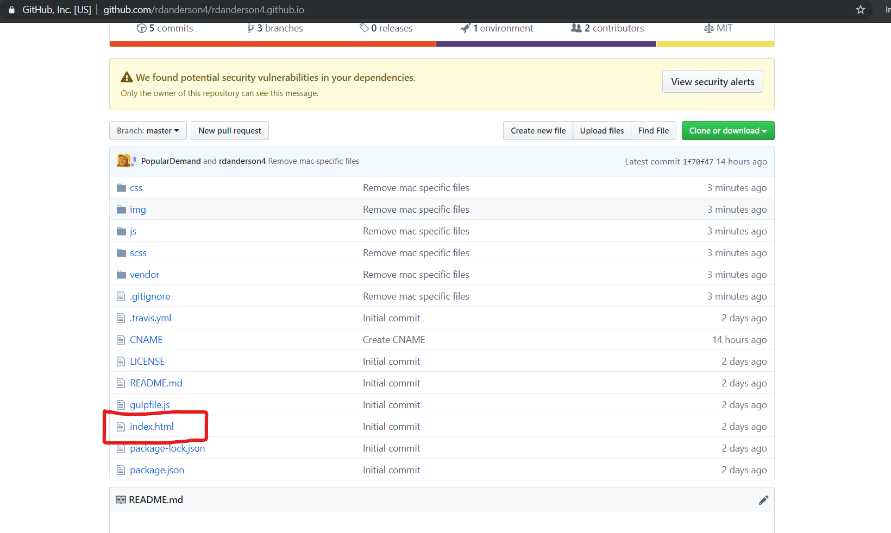
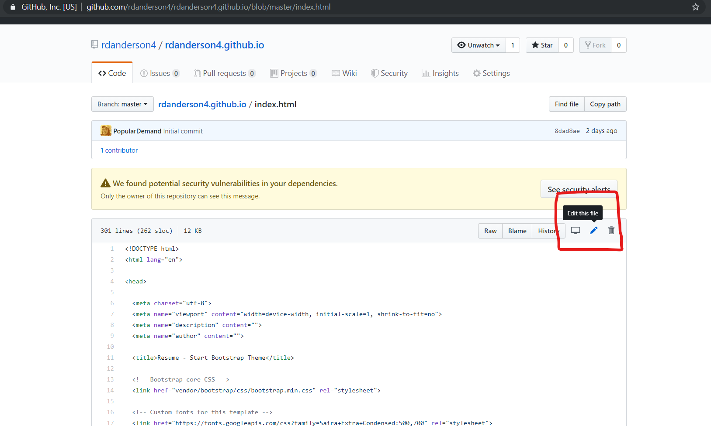
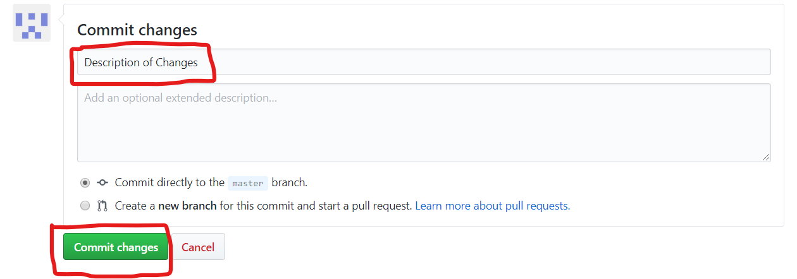
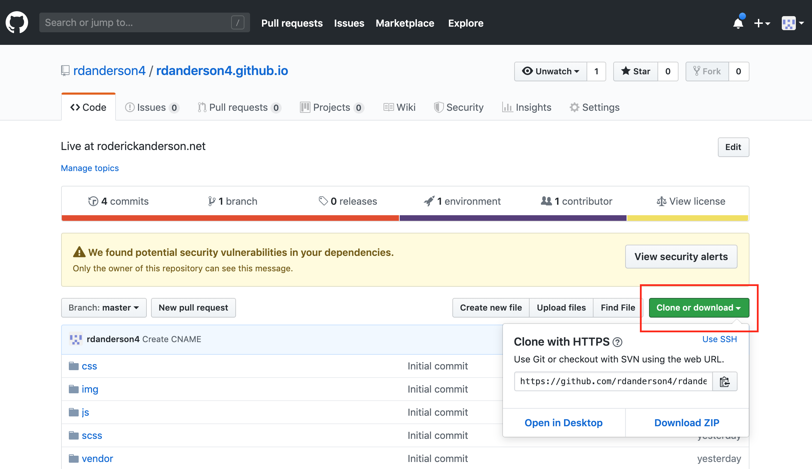
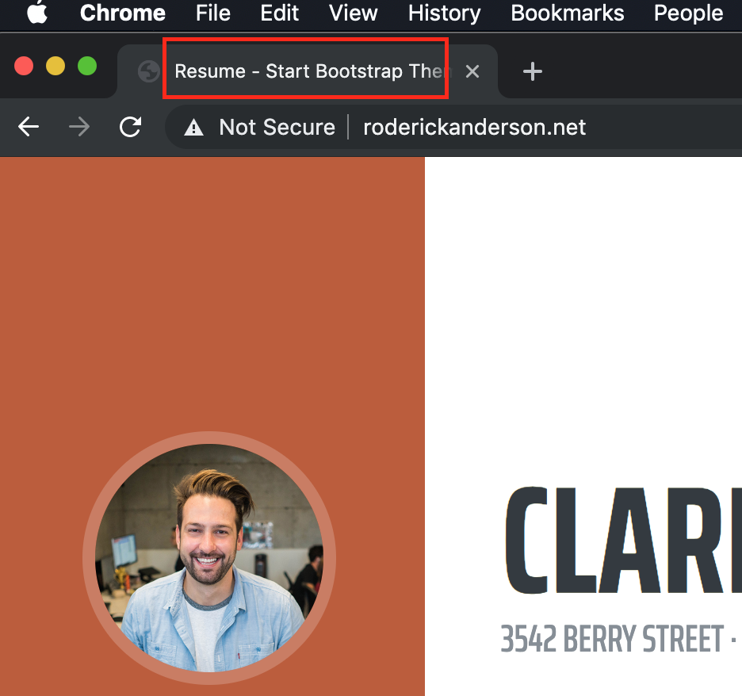
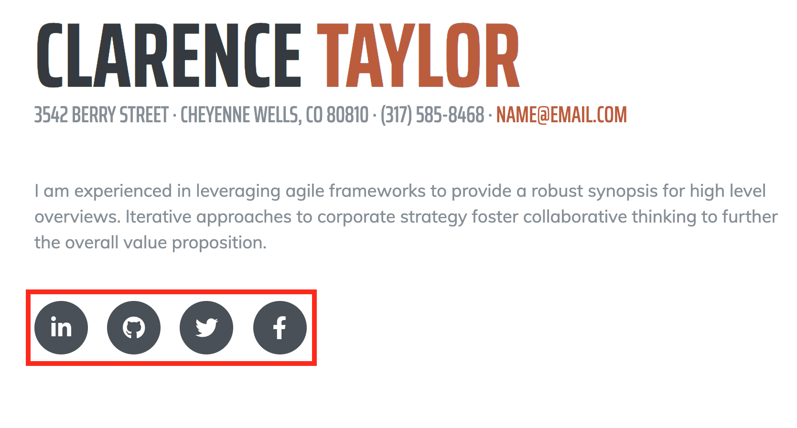

# Your personal website

Your website is live at [www.roderickanderson.net](www.roderickanderson.net). This is the code for the website. The webserver serving this website is _this_ website, GitHub.com, using one of their services, [GitHub Pages](https://pages.github.com/). In fact, because of GitHub pages, this site is also live at [rdanderson4.github.io](https://rdanderson4.github.io).

To make changes to your website, all you have to do is make changes to this code here. You will see the code changes almost immediately at [rdanderson4.github.io](https://rdanderson4.github.io), but changes will lag up to a day for the change to propogate to [roderickanderson.net](www.roderickanderson.net).

To see this in action, do the following:

1. Go to the list of files within GitHub and click on index.html 
2. Click the pencil on the right to edit the file directly within the GitHub interface 
3. Find where it says Clarence Thomas, around line 66. Change that to be your first and last name.
4. At the bottom of the page, type in a description of your changes, and click "Commit changes". 
5. You can now navigate to rdanderson4.github.io, and it will show your name instead of Clarence!
6. The changes will propogate to [roderickanderson.net](roderickanderson.net) usually within 20 minutes.

You now know _enough_ to completely personalize your site. You just have to edit index.html to contain your information. Below, I will go into simple steps to cover simple technologies that will make the process of making sites like this simple.

:hooray: :hooray: :hooray:

## Git the Code
Git is a version-control system for tracking changes in code during development. You will use it to copy files from GitHub and then again to copy your changes version of the files back to GitHub.

1. Copy the location of the files on GitHub. Get the HTTPS version, not SSH. 
2. Download [Git for Windows](https://git-scm.com/download/win).
3. Open your cmd terminal.
4. Type `git`. You should see git's docs output. If you don't, oOpen start menu and type `git` and open the cmd terminal with git enabled.
5. Within C:/ type
```
md websites
cd websites
git clone [the url copied above]
```
6. Find the files you copied within Windows file explorer. It should be in a folder called `websites` within your named directory. Open index.html with your browser. You will use this browser to verify the changes you will make.
6. You can now open the files using Notepad to make the changes. You can also download [Notepad++](https://notepad-plus-plus.org/download/v7.7.1.html) which offers a better user experience for changing HTML files. Change the webpage to your liking, but definitely change the items in the section "What to Change".
7. When you are finished making changes, save your changes, and copy your changes to GitHub. Within the cmd terminal type
```
git add .
git commit -m '[Description of your Changes]'
git push origin master
```

If it works, navigate to [rdanderson4.github.io](rdanderson4.github.io), and you should see your changes farly quickly. You may need to open an incognito window.

## What to Change
### Header Title:
The title within the browser tab! 
### Content:
Any and all content! [content](readme/content.png)
### Photo:
Use your face! 
### Links:
Make sure they link to the right place! 
### Color:
Change at least one color within scss/_variables.scss

## Why
After you do this you will have experience deploying a website, using HTML, and using CSS. You will have expereince with git and GitHub. You will be able to take **any** pre-made template and deploy a _customized_ static website for yourself or clients.

## More templates
You can now replicate this process using any multitude of free templates available online. You can use [Start Bootstrap](https://startbootstrap.com) or [any other provider](https://www.google.com/search?q=free+bootstrap+templates)

## FAQs
**roderickanderson.net?** - I currently own the domain name, but I will transfer it to you when you want to learn about DNS and DNS providers.

**How do I get clients?** - Offer your services on Craigslist, fiverr, or in person.

**Who needs websites?** - Friends, family, businesses organizations. I recommend getting comfortable with one template at a time, then marketing to that audience. For example, get really good at this template, then market to job seekers and students.

## Copyright and License
[Resume](https://startbootstrap.com/template-overviews/resume/) is a resume and CV theme for [Bootstrap](http://getbootstrap.com/) created by [Start Bootstrap](http://startbootstrap.com/). This theme features a fixed sidebar with content sections to build a simple, yet elegant resume. is Copyright 2013-2019 Blackrock Digital LLC. Code released under the [MIT](https://github.com/BlackrockDigital/startbootstrap-resume/blob/gh-pages/LICENSE) license.
