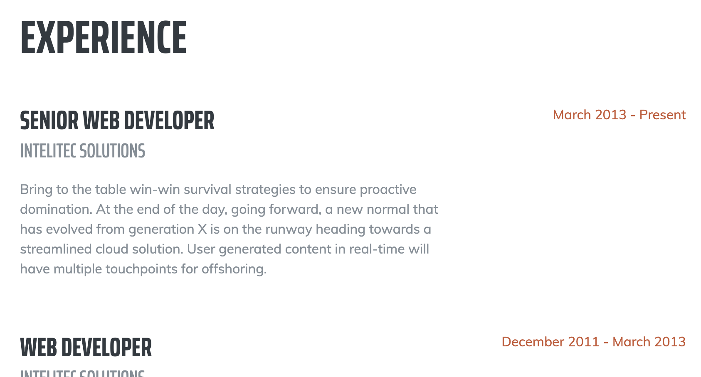

# [Start Bootstrap - Resume](https://startbootstrap.com/template-overviews/resume/)

[Resume](https://startbootstrap.com/template-overviews/resume/) is a resume and CV theme for [Bootstrap](http://getbootstrap.com/) created by [Start Bootstrap](http://startbootstrap.com/). This theme features a fixed sidebar with content sections to build a simple, yet elegant resume.

## Download
download [git for Windows](https://git-scm.com/download/win)

## what to change

## how to save
git add .
git commit msg
git push origin master

## what to change
## how to save
## wait

## Usage

### Basic Usage

After downloading, simply edit the HTML and CSS files included with the template in your favorite text editor to make changes. These are the only files you need to worry about, you can ignore everything else! To preview the changes you make to the code, you can open the `index.html` file in your web browser.

### Advanced Usage

After installation, install [Node JS](nodejs.org). Then from the project directory, run `npm install` and then run `npm start` which will open up a preview of the template in your default browser, watch for changes to core template files, and live reload the browser when changes are saved. You can view the `gulpfile.js` to see which tasks are included with the dev environment.

## Copyright and License

Copyright 2013-2019 Blackrock Digital LLC. Code released under the [MIT](https://github.com/BlackrockDigital/startbootstrap-resume/blob/gh-pages/LICENSE) license.
